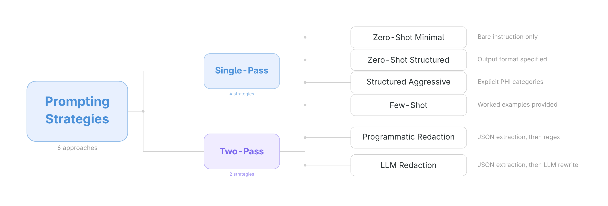
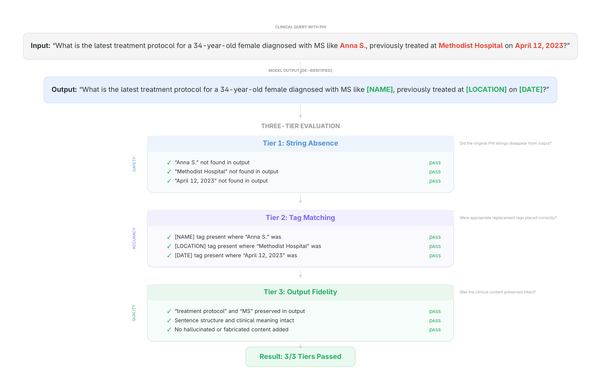

# SLM De-identification Evaluation

Can small language models (3 to 4 billion parameters) remove patient-identifying information from clinical text before it leaves a hospital network? This repository contains the evaluation harness and results for testing that question.

## What This Does

We tested 3 small language models across 6 different prompting approaches to see how well they detect and redact Protected Health Information (PHI) from clinical search queries. Each model runs entirely on the user's device via [Ollama](https://ollama.com/), so no patient data ever leaves the machine.

**Study design:** 3 models x 6 prompting strategies x 3 runs per configuration, evaluated on 1,051 clinical queries with three-tier scoring.

## Models

All models are quantized (Q4_K_M) and run locally via Ollama. Any machine with 8+ GB of RAM can run these.

| Model | Parameters | Company | Ollama Tag |
|-------|-----------|---------|------------|
| Phi-4 Mini Instruct | 3.8B | Microsoft | `phi4-mini:latest` |
| Llama 3.2 3B Instruct | 3.21B | Meta | `llama3.2:3b` |
| Gemma 3 4B | 4.0B | Google | `gemma3:4b` |

## Prompting Strategies



We tested six ways of asking the model to de-identify text, ranging from a single sentence instruction to multi-step pipelines:

| Strategy | How it works |
|----------|-------------|
| **Zero-Shot Minimal** | One-sentence instruction: "Remove all PHI and replace with tags." |
| **Zero-Shot Structured** | Detailed instructions listing exactly what counts as PHI, what to preserve, and how to handle uncertainty (conservative: when unsure, leave it). |
| **Zero-Shot Structured (Aggressive)** | Same as above, but when unsure, tag it as PHI. Tests how the uncertainty instruction affects recall vs. over-redaction. |
| **Few-Shot** | Three worked examples (including a tricky case with no PHI) before the actual query. All examples are synthetic to avoid data leakage. |
| **Two-Pass (Programmatic Redaction)** | Step 1: Ask the model to list all PHI it finds as structured JSON. Step 2: A simple find-and-replace script swaps each identified PHI span with its tag. The model only identifies; deterministic code does the redacting. |
| **Two-Pass (LLM Redaction)** | Same Step 1 as above. Step 2: Instead of find-and-replace, the model itself performs the redaction given the PHI list. Comparing this against programmatic redaction isolates whether the model introduces errors during the replacement step. |

Full prompt templates are in [`configs/prompt_templates.json`](configs/prompt_templates.json).

## Evaluation

Each model output is scored on three tiers:



## Results

All 18 configurations (3 models x 6 strategies) were evaluated against the ASQ-PHI benchmark. **No configuration met both the 95% recall AND 10% over-redaction thresholds simultaneously**, supporting H1.

The closest configuration was **Gemma 3 4B with few-shot prompting** (94.8% recall, 11.4% over-redaction), falling just short on both thresholds. For comparison, Amazon Comprehend Medical achieved 98.6% recall but with 90.0% over-redaction at threshold 0.0, illustrating the recall/specificity tradeoff with cloud-based tools.

| Model | Strategy | T1 Recall | Over-Redaction | T3 Similarity |
|-------|----------|-----------|----------------|---------------|
| Gemma 3 4B | Zero-Shot Minimal | 99.5% | 99.1% | 0.868 |
| Gemma 3 4B | Zero-Shot Structured | 96.1% | 89.4% | 0.877 |
| Gemma 3 4B | Structured (Aggressive) | 96.3% | 90.4% | 0.856 |
| **Gemma 3 4B** | **Few-Shot** | **94.8%** | **11.4%** | **0.962** |
| Gemma 3 4B | Two-Pass (Programmatic) | 99.2% | 90.0% | 0.142 |
| Gemma 3 4B | Two-Pass (LLM) | 99.2% | 91.3% | 0.141 |
| Llama 3.2 3B | Zero-Shot Minimal | 99.6% | 35.6% | 0.344 |
| Llama 3.2 3B | Zero-Shot Structured | 99.3% | 100.0% | 0.692 |
| Llama 3.2 3B | Structured (Aggressive) | 99.4% | 99.5% | 0.682 |
| Llama 3.2 3B | Few-Shot | 99.0% | 81.7% | 0.819 |
| Llama 3.2 3B | Two-Pass (Programmatic) | 97.9% | 95.0% | 0.617 |
| Llama 3.2 3B | Two-Pass (LLM) | 97.9% | 83.1% | 0.610 |
| Phi-4 Mini | Zero-Shot Minimal | 80.8% | 87.2% | 0.288 |
| Phi-4 Mini | Zero-Shot Structured | 96.6% | 90.4% | 0.784 |
| Phi-4 Mini | Structured (Aggressive) | 96.6% | 90.9% | 0.772 |
| Phi-4 Mini | Few-Shot | 94.9% | 57.6% | 0.667 |
| Phi-4 Mini | Two-Pass (Programmatic) | 92.2% | 0.0% | 0.486 |
| Phi-4 Mini | Two-Pass (LLM) | 93.5% | 69.9% | 0.872 |

**Key findings:**
- Few-shot prompting consistently produced the best balance of recall and specificity across all three models.
- Zero-shot strategies tended toward high recall but extreme over-redaction, stripping clinical meaning along with PHI.
- Two-pass (programmatic) strategies showed the model can identify PHI but deterministic replacement introduces formatting artifacts that hurt Tier 2 and Tier 3 scores.
- Gemma 3 4B was the strongest overall performer; Phi-4 Mini showed the most variance across strategies.

Full results are in [`results/analysis/final_results.json`](results/analysis/final_results.json).

## Quick Start

### Requirements

- Python 3.10+
- [Ollama](https://ollama.com/) installed and running
- Any machine with 8+ GB RAM (tested on both Apple Silicon and NVIDIA GPUs)

### Setup

```bash
pip install -r requirements.txt
ollama pull phi4-mini:latest
ollama pull llama3.2:3b
ollama pull gemma3:4b
```

### Run a single evaluation

```bash
python -m src.runner --model phi4-mini --prompt zero-shot-minimal --run 1 --host http://localhost:11434
```

### Evaluate all results

```bash
python -m src.evaluator --all --output-dir .
python -m src.analyzer --output-dir .
```

## Repository Structure

```
configs/              Model, prompt, and inference configurations (JSON)
src/                  Evaluation harness (runner, evaluator, analyzer)
data/                 Dataset documentation and links
scripts/              Data preparation, figure generation, and reprocessing utilities
raw/                  Raw model outputs (generated at runtime, not committed)
results/processed/    Per-query evaluation scores
results/analysis/     Cross-model comparison tables and final_results.json
figures/              Strategy overview and evaluation tier diagrams
```

## Benchmark

All models are evaluated against the [ASQ-PHI](https://github.com/JamesWeatherhead/asq-phi) benchmark:

- 1,051 clinical search queries (832 containing PHI, 219 hard negatives with no PHI)
- 2,973 PHI elements across 13 HIPAA Safe Harbor categories
- **Dataset:** [Mendeley Data](https://data.mendeley.com/datasets/csz5dzp7nx/1)
- **Paper:** [Weatherhead, J. (2026). ASQ-PHI. *Data in Brief*.](https://www.sciencedirect.com/science/article/pii/S2352340926001393)

## Related Work

- **Local PHI Scrubber** (Chrome extension using Phi-3 Mini for on-device redaction): [github.com/JamesWeatherhead/local-phi-scrubber](https://github.com/JamesWeatherhead/local-phi-scrubber)

## Citation

Weatherhead, J. & McCaffrey, P. (2026). Evaluating Small Language Models for Clinical Text De-identification. *Frontiers in Digital Health*. (Manuscript in preparation)

## License

MIT
